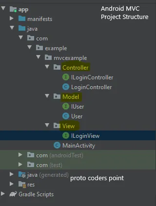

# MVC EXAMPLE SORCE CODE
* ## MODEL VIEW CONTROLLER
	* [Model](#model)
	* [Controller](#controller)
	* [View](#view)

----

<br>


Android MVC Project Structure  <br><br>

# Model

## IUser.Java (Interface)

```java
package com.example.mvcexample.Model;
public interface IUser {
    String getEmail();
    String getPassword();
    int isValid();
}
```

## User.java (class)

```java
package com.example.mvcexample.Model;

import android.text.TextUtils;
import android.util.Patterns;

/**
 * User 객체를 만들어서 값을 전달 
 */

public class User implements IUser{
    private  String email,password;

    public User(String email, String password) {
        this.email = email;
        this.password = password;
    }

    @Override
    public String getEmail() {
        return email;
    }

    @Override
    public String getPassword() {
        return password;
    }

    @Override
    public int isValid() {
        // 0. Check for Email Empty
        // 1. Check for Email Match pattern
        // 2. Check for Password > 6

        if(TextUtils.isEmpty(getEmail()))
            return  0;
        else if(!Patterns.EMAIL_ADDRESS.matcher(getEmail()).matches())
            return  1;
        else if(TextUtils.isEmpty(getPassword()))
            return 2;
        else if(getPassword().length()<=6)
           return 3;
        else
            return -1;
    }
}
```

# Controller

## ILoginController (Interface)

```java
package com.example.mvcexample.Controller;
public interface ILoginController {
    void OnLogin(String email,String Password);
}
```

## LoginController (Class)

```java
package com.example.mvcexample.Controller;

import com.example.mvcexample.Model.User;
import com.example.mvcexample.View.ILoginView;

public class LoginController implements ILoginController {

    ILoginView loginView;

    public LoginController(ILoginView loginView) {
        this.loginView = loginView;
    }

    @Override
    public void OnLogin(String email, String password) {
        // User 객체는 Model에 속한다.
        User user = new User(email,password);
        int loginCode = user.isValid();
        if(loginCode == 0)
        {
            loginView.OnLoginError("Please enter Email");
        }else  if (loginCode == 1){
            loginView.OnLoginError("Please enter A valid Email");
        } else  if (loginCode == 2)
        {
            loginView.OnLoginError("Please enter Password");
        }else  if(loginCode == 3){
            loginView.OnLoginError("Please enter Password greater the 6 char");
        }
        else {
            loginView.OnLoginSuccess("login Successful");
        }
    }
}
```

# View

## ILoginView (Interface)

```java
package com.example.mvcexample.View;

public interface ILoginView {
    void OnLoginSuccess(String message);
    void OnLoginError(String message);
}
```

>MainActivity

## MainActivity.xml

```xml
<?xml version="1.0" encoding="utf-8"?>
<LinearLayout xmlns:android="http://schemas.android.com/apk/res/android"
    xmlns:app="http://schemas.android.com/apk/res-auto"
    xmlns:tools="http://schemas.android.com/tools"
    android:layout_width="match_parent"
    android:layout_height="match_parent"
    tools:context=".MainActivity">

    <LinearLayout
        android:orientation="vertical"
        android:layout_width="match_parent"
        android:layout_height="match_parent"
        android:layout_gravity="center"
        android:gravity="center">
        <TextView
            android:layout_width="wrap_content"
            android:layout_height="wrap_content"
            android:text="Login Form"/>

        <EditText
            android:id="@+id/email"
            android:layout_width="match_parent"
            android:layout_height="wrap_content"
            android:layout_margin="20dp"
            android:hint="Email"/>

        <EditText
            android:id="@+id/password"
            android:layout_width="match_parent"
            android:layout_height="wrap_content"
            android:layout_margin="20dp"
            android:hint="Password"/>

        <Button
            android:layout_width="wrap_content"
            android:layout_height="wrap_content"
            android:text="Login"
            android:id="@+id/loginb"/>
    </LinearLayout>

</LinearLayout>
```

## MainActivity.java

```java
package com.example.mvcexample;

import androidx.appcompat.app.AppCompatActivity;

import android.os.Bundle;
import android.view.View;
import android.widget.Button;
import android.widget.EditText;
import android.widget.Toast;

import com.example.mvcexample.Controller.ILoginController;
import com.example.mvcexample.Controller.LoginController;
import com.example.mvcexample.View.ILoginView;

public class MainActivity extends AppCompatActivity  implements ILoginView {
    EditText email,password;
    Button loginb;
    ILoginController loginPresenter;

    @Override
    protected void onCreate(Bundle savedInstanceState) {
        super.onCreate(savedInstanceState);
        setContentView(R.layout.activity_main);

        email = (EditText) findViewById(R.id.email);
        password = (EditText)findViewById(R.id.password);

        loginb = (Button) findViewById(R.id.loginb);
        loginPresenter = new LoginController(this);

        loginb.setOnClickListener(new View.OnClickListener() {
            @Override
            public void onClick(View v) {
                loginPresenter.OnLogin(email.getText().toString().trim(),password.getText().toString().trim());
            }
        });
    }

    @Override
    public void OnLoginSuccess(String message) {
        Toast.makeText(this,message,Toast.LENGTH_SHORT).show();
    }

    @Override
    public void OnLoginError(String message) {
        Toast.makeText(this,message,Toast.LENGTH_SHORT).show();
    }
}
```
* MainActivity의 경우 Android 내부에서 View일수도 있으며 Controller일수도 있다.