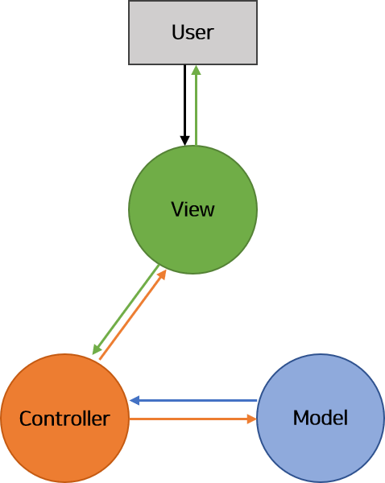
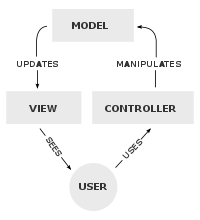
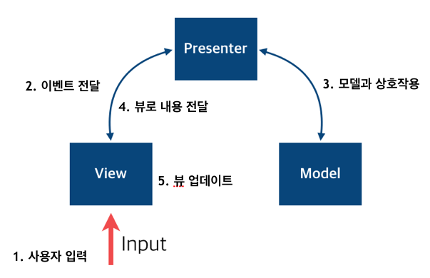
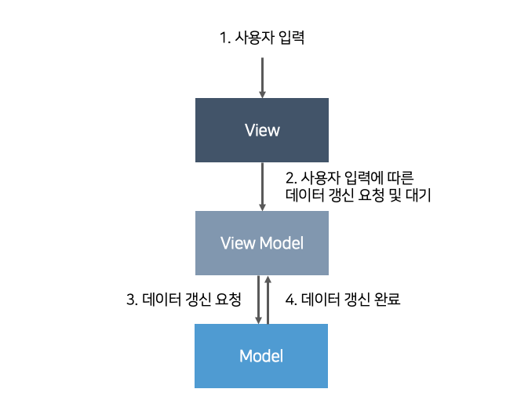
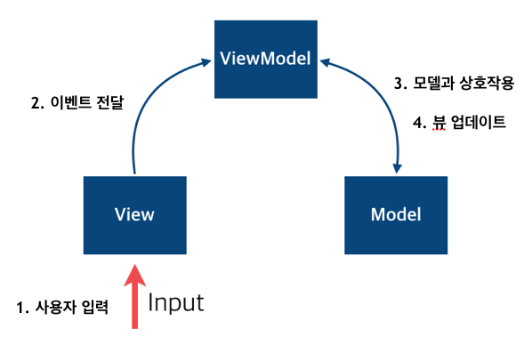

# android_study

 

----

 

## Design Pattern
* ### [MVC](#mvc-디자인-패턴)
    * [EX_CODE](./ex_sorce_code/ex_mvc_sorce_code.md)
* ### [MVP Pattern](#mvp-디자인-패턴)
    * [EX_CODE](./ex_sorce_code/ex_mvp_sorce_code.md)
* ### [MVVM Pattern](#mvvm-디자인-패턴)
    * [EX_CODE](./ex_sorce_code/ex_mvvm_sorce_code.md)
* ### [FLUX Pattern](#flux-디자인-패턴)

 

----

 

## 마크다운 문법 주의
* ### 내부 링크로 가는 아이디의 경우 소문자로 만들어야 함

----

 

[참고 블로그 1](https://velog.io/@iamjoo/mvc-mvp-mvvm-flux-%EB%94%94%EC%9E%90%EC%9D%B8-%ED%8C%A8%ED%84%B4-86ocg4bf), [참고 블로그 2](https://heegs.tistory.com/17), [참고 블로그 3](https://stonybean.blogspot.com/2019/03/blog-post.html), [참고 블로그 4 (ticTacToe)](https://ckanywhere.tistory.com/2) 
[의존성 참고 블로그](https://velog.io/@huttels/%EC%9D%98%EC%A1%B4%EC%84%B1%EC%9D%B4%EB%9E%80),

## MVC 디자인 패턴
### MVC (Model View Controller)

[MVC Ex Code 참고사이트 1](https://protocoderspoint.com/model-view-controller-android-mvc-example-login-validation/), [MVC Ex code 참고사이트 2](https://jroomstudio.tistory.com/21) 

 
&nbsp;&nbsp;&nbsp;

  

**상태가 변경되었다는 정보를 View와 Model이 서로 양방향으로 주고받는 형태**

* Model : 데이터 처리하는 부분
* View : 화면 UI 담당
* Controller : 사용자의 입력을 받고 Model, View의 중개인 역할을 담당
    * 사용자의 입력이 들어오면 View와 Model에게 각각 어떠한 일을 할지 알려주는 역할 
    때문에 View와 Model의 ***의존성 (A는 B없이 작동할 수 없고 B를 재사용하지 않으면 A또한 재사용할 수 없다.)*** 이 생기고, Controller를 통해 복잡하게 연결되면 유지보수가 어려워진다.

* 특징 : 
    * Controller와 View는 ***1:1*** 관계가 아닌 ***1:N*** 관계로, Controller가 여러 개의 View를 선택하여 Model을 나타낼 수 있다.
    * View와 Model 서로간의 의존성이 높다는 단점이 있다.  
    따라서, View와 Model간의 **의존성을 최대한 낮게 설계한 경우** 좋은 MVC 패턴이라 할 수 있다.
 

---

 

## MVP 디자인 패턴
### MVP (Model View Presenter)
[MVP Ex code 참고사이트 1](https://cjw-awdsd.tistory.com/9), [MVP Ex code 참고사이트 2](https://youngest-programming.tistory.com/111), [MVP Ex code 참고사이트 3](https://jroomstudio.tistory.com/22) 

 
&nbsp;&nbsp;&nbsp;
  

* Model : 데이터 처리하는 부분
* View : 화면 UI 담당 + 사용자 입력 받음
* Presenter : View와 Model 사이에서 자료 전달 역할

* 특징 : 
    * Presenter를 통해 Model, View **완벽하게 분리**가 가능합니다.
    * View와 Presenter의 관계는 **1:1** 입니다.
    * 앱이 커질수록 View와 Presenter의 의존성이 생기게 됩니다.
    * MVC에서는 사용자의 이벤트에 Controller가 먼저 반응한 후 View를 가져와 적절한 작업 후 반환한다. 
    MVP에서는 사용자의 이벤트에 View가 먼저 반응한 후 Presenter에 알리고 작업을 처리한 후 View한테 다시 알려준다.
    * Contrller와 역할이 비슷하지만 Interface를 사용한다는 것의 차이가 있다.  
    View에서 전달된 이벤트에 따라 Model에서 데이터 요청후 전달하는 중간 역할 담당.
 

---

 

## MVVM 디자인 패턴
### MVVM (Model View ViewModel)
[MVVM Ex code 참고사이트 1](https://aonee.tistory.com/48), [MVVM Ex code 참고사이트 2](https://skytitan.tistory.com/79), [MVVM Ex code 참고사이트 3](https://github.com/ericmaxwell2003/ticTacToe/tree/mvvm), [MVVM Ex code 참고사이트 4](https://programmingfbf7290.tistory.com/entry/%EC%95%88%EB%93%9C%EB%A1%9C%EC%9D%B4%EB%93%9C-mvp%EC%99%80-mvvm-%EC%98%88%EC%A0%9C%EB%A1%9C-%EC%95%8C%EC%95%84%EB%B3%B4%EC%9E%903-MVVM) 

 
&nbsp;&nbsp;&nbsp;
  

* Model : 
    * 데이터 처리하는 부분
* View : 
    * 화면 사용자에게 제공되는 UI
    * 사용자의 입력을 받고 이벤트를 자신이 사용할 뷰모델로 전달
* ViewModel : 
    * 뷰를 나타내주기 위한 모델 + 뷰의 표현 로직 담당
    * 뷰와 독립적
    * UI 관련 데이터 보관, 관리
    * 모델이 변경되면 관련된 뷰모델을 사용하는 뷰가 자동 업데이트

* 특징 : 
    * DataBinding을 사용하면 UI에 관련된 코드를 xml에 작성할 수 있습니다.
    * 장점 :
        * 뷰에 대한 의존성이 전혀 없으므로 유닛 테스트 용이
    * 단점 :
        * 뷰에 대한 처리가 복잡해 질수록 뷰모델이 거대해짐
        * 상대적으로 뷰는 아무 역할도 하지 않음
        * 뷰모델이 또다른 형태의 액티비티 클래스 구현으로 변질
 

---

 

## FLUX 디자인 패턴
### Flux Design Pattern

[FLUX 참고 블로그 1](https://lemontia.tistory.com/637), [FLUX 참고 블로그 2](https://im-designloper.tistory.com/17) 

* MVC의 문제를 해결할 목적으로 고안한 애플리케이션 아키텍쳐입니다. 
* Flux 애플리케이션은 디스패처(Dispatcher), 스토어(Store), 뷰(View) 등 세 부분으로 구성됩니다.
* 뷰는 단순히 화면에 보여지는 것을 넘어 자식 뷰로 전달도 하는 컨트롤 역할도 병행합니다. 
    그래서 **Controller View**라고 불리기도 합니다.
* ReactJS의 **Redux의 디자인패턴**이기도 하다
* 모든 변경 사항은 **Action -> Dispatcher 를 거쳐서 Store에 영향을 미친다는 점**

 
&nbsp;&nbsp;&nbsp;
  

* Action : 
    * 디스패처 특징 메소드를 실행하면 스토어에 변화를 일으킬 수 있습니다. 
    이때 이 **데이터 묶음**을 **액션**이라 하고, 전달할 액션 객체는 액션 생성자라는 함수를 통해 만들어집니다.
    * 뷰에서 **액션생성자(Action creator)를 실행**하여 전달할 메세지을 생성하고, **디스패처에 전달**하여 스토어에 저장되어 있는 **상태를 변경**하는 것입니다.
* Dispatcher : 
    * 디스패처는 Flux 애플리케이션의 **모든 데이터 흐름을 관리하는 허브 역할**을 합니다.
    * 액션이 발생하면 디스패처로 메세지나 액션 객체가 전달되고 디스패처에서는 등록된 콜백함수를 통해 이 메세지를 스토어에 전달합니다.
    * 다른 구성요소와 달리 디스패처는 **전체 애플리케이션**에서 **한 개의 인스턴스만 사용**합니다.
* Store : 
    * 스토어는 애플리케이션 상태를 저장합니다.
    * Flux의 스토어는 상태를 다루기 때문에 무엇이든 저장할 수 있고 단순한 Object로 구성되어 있습니다. 
    * 모든 상태변경은 **스토어에 의해서 결정**되어야만 하며, **상태변경을 위한 요청을 스토어에 직접 보낼 수 없습니다.**
    * 무조건 액션 생성자를 통해 **디스패처를 통해 액션을 보내야만 수정이 가능**해집니다.
* View OR The Controller View : 
    * 상태를 가져와서 보여주고 입력받을 화면을 보여주는 역할
    * 스토어와 뷰 사이의 **중간관리자**같은 역할
    * 상태가 변경되었을 때 스토어가 그 사실을 컨트롤러 뷰에게 알려주면, 컨트롤러 뷰는 자신 아래에 있는 모든 뷰에게 새로운 상태를 넘겨줍니다.

* 특징 : 
    * **단방향 데이터 흐름(unidirectional data flow)**
    * 데이터 흐름은 디스패처 => 스토어 => 뷰 로 흘러가며 뷰에서 입력되는 데이터가 발생하면 액션(Action)을 이용해 디스패처로 향하도록 합니다. 
    * 이러한 흐름의 ***장점***은 데이터를 **직접 수정할 수 없고** 반드시 액션을 통해서만 수정이 일어나기 때문에 **교통정리가 가능**해 진다는 점입니다. 
 

---