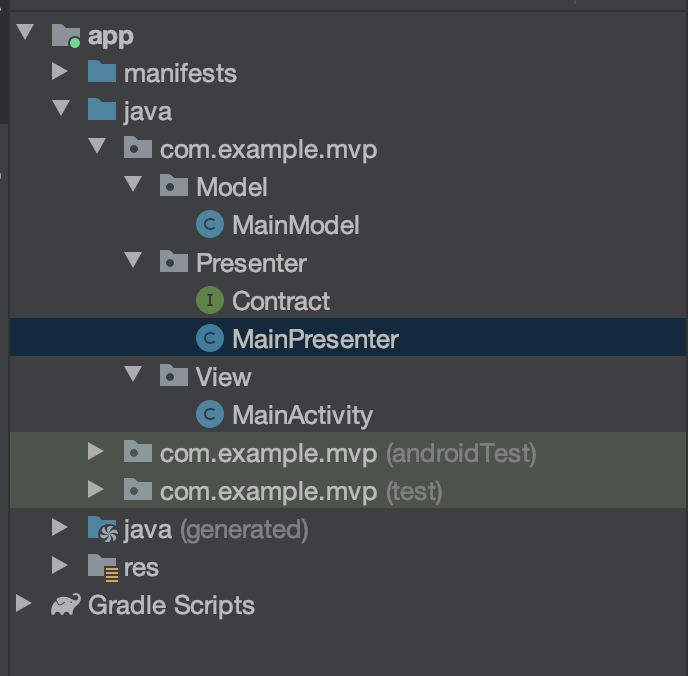

# MVP EXAMPLE SORCE CODE
* ## MODEL VIEW PRESENTER
	* [Model](#model)
	* [Presenter](#presenter)
	* [View](#view)

----

<br>


Android MVP Project Structure  <br><br>

# Model

## MainModel.Java (class)

```java
//MainModel class
//데이터 관리를 해줄 클래스
package com.example.mvp.Model;

import com.example.mvp.Presenter.Contract;

//Model
public class MainModel {
    Contract.Presenter presenter;
    public MainModel(Contract.Presenter presenter){
        this.presenter = presenter;
    }
    public saveData(int data){
    	//처리 로직
    }
}
```

# Presenter

## Contract (Interface)

```java
//Contract Interface
//View와 Presenter를 연결하기 위한 Interface
package com.example.mvp.Presenter;

public interface Contract {
    interface View{
        void showResult(int answer);      //값을 보여줄 View 메소드 선언
    }
    interface Presenter{
        void addNum(int num1, int num2);  //결과 값 구하기 위한 메소드 선언
    }
}
```

## MainPresenter (Class)

```java
//MainPresenter class
//Model과 View를 연결하여 동작을 처리해
package com.example.mvp.Presenter;

import com.example.mvp.Model.MainModel;

//Presenter줌
public class MainPresenter implements Contract.Presenter {
    Contract.View view;
    MainModel mainModel;
    public MainPresenter(Contract.View view){
        this.view = view;                   //Activty View정보 가져와 통신
        mainModel = new MainModel(this);    //Model 객체 생성
    }
    
    //Presenter를 상속하고 addNum 구현
    @Override
    public void addNum(int num1, int num2) {
        view.showResult(num1 + num2);
    }
}
```

# View

## MainActivity (class)

```java
//MainActivity class
package com.example.mvp.View;

import androidx.appcompat.app.AppCompatActivity;

import android.os.Bundle;
import android.view.View;
import android.widget.Button;
import android.widget.EditText;
import android.widget.TextView;

import com.example.mvp.Presenter.Contract;
import com.example.mvp.Presenter.MainPresenter;
import com.example.mvp.R;

//View
public class MainActivity extends AppCompatActivity implements Contract.View {
    private EditText number1;		//입력할 EditText
    private EditText number2;		//입력할 EditText
    private Button sumButton;
    private Contract.Presenter presenter;	//presenter와 통신하기 위해 객체 생성
    @Override
    protected void onCreate(Bundle savedInstanceState) {
        super.onCreate(savedInstanceState);
        setContentView(R.layout.activity_main);
        presenter = new MainPresenter(this);
        init();
    }

    private void init(){
        sumButton = (Button)findViewById(R.id.sum);
        number1 = (EditText)findViewById(R.id.number1);
        number2 = (EditText)findViewById(R.id.number2);
        
        //버튼 클릭
        sumButton.setOnClickListener(new View.OnClickListener() {
            @Override
            public void onClick(View view) {
            	//결과 값 계산
                presenter.addNum(Integer.parseInt(number1.getText().toString()),
                        Integer.parseInt(number2.getText().toString()));
            }
        });
    }
    @Override
    public void showResult(int answer) {
        ((TextView)findViewById(R.id.result)).setText(Integer.toString(answer));
    }
}
```
* MainActivity의 경우 Android 내부에서 View일수도 있으며 Controller일수도 있다.